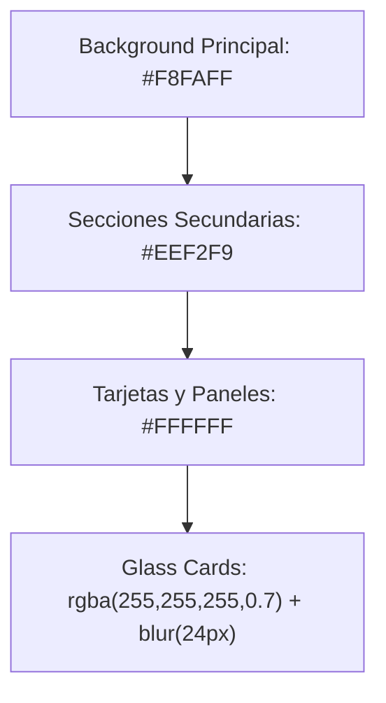
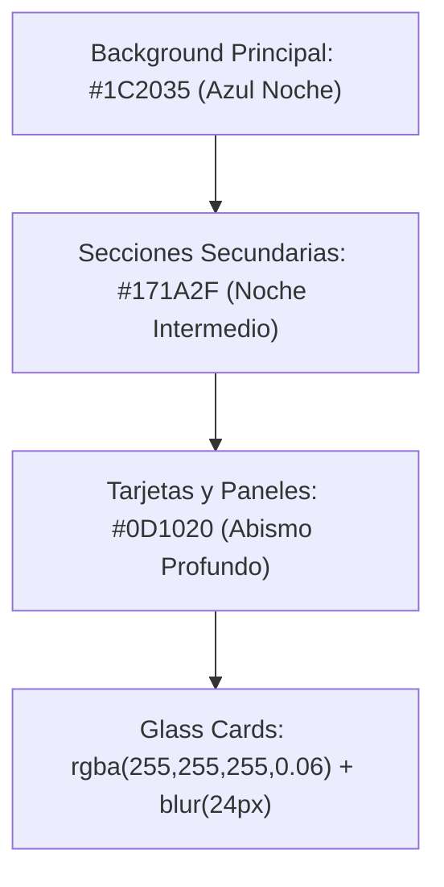

# KUDEN DESIGN SYSTEM
*Premium AI Platform UI/UX Specification & Migration Roadmap*

Este documento sirve como la **referencia visual y técnica definitiva** de la interfaz premium de Kuden IA. Define la esencia de la marca, los componentes del sistema de diseño, la configuración de variables globales (Fase 1) y la guía de migración para los componentes React (Fase 2).

---

## 1. Esencia de la Marca (Brand Essence)

KUDEN es una empresa de IA enfocada en agentes conversacionales, automatización y plataformas inteligentes. El lenguaje visual debe transmitir tecnología avanzada con un toque orgánico y humano.

### Fuentes de Inspiración Visual:
*   **Apple Intelligence:** Por su tecnología orgánica, bordes suaves, desenfoques profundos y transiciones fluidas.
*   **Stripe:** Por sus esquemas de color limpios, tipografía de alta legibilidad, componentes meticulosos y micro-animaciones impecables.
*   **Linear:** Por el minimalismo extremo, interfaces de alta densidad pero muy ordenadas y uso sofisticado del modo oscuro.
*   **OpenAI:** Por la sobriedad, elegancia y estética orientada a la inteligencia artificial pura.
*   **Arc Browser:** Por el control del espacio de trabajo, sidebar flotante con bordes curvos y sensación de "aplicación nativa".

### Principios de Diseño:
> [!NOTE]
> *   **Premium & Minimalista:** Sin ruido visual. El espacio en blanco es tan importante como el contenido.
> *   **Elegante y Confiable:** Evitar estéticas cyberpunk extremas, gradientes chillones o bordes con esquinas duras.
> *   **Legibilidad Extrema:** Contraste impecable y jerarquía tipográfica limpia.
> *   **Glassmorphic:** Uso estratégico de fondos translúcidos y bordes finos con desenfoque de fondo (`backdrop-filter: blur(24px)`).

---

## 2. Tipografía & Espaciado

### Tipografía
*   **Fuente Principal (Logo y Títulos):** `Space Grotesk` (Pesos: 500, 600, 700).
    *   *Letter-spacing:* `-0.02em` en headings para dar un toque moderno y compacto.
*   **Fuente Secundaria (Cuerpo y Chat):** `Inter` (Pesos: 400, 500, 600).
*   **Line-height base:** `1.4` para asegurar una lectura fluida.

### Sistema de Espaciado (Grilla de 8px)
Generoso uso del aire. Layouts limpios y no sobrecargados:
$$\text{Grilla Base} = [8px, 16px, 24px, 32px, 48px, 64px, 96px, 128px]$$

---

## 3. Radios & Esquinas (Radii)

Para transmitir suavidad y modernidad orgánica, el diseño elimina por completo las esquinas duras:

| Elemento | Radio (Radius) | Variable CSS |
| :--- | :--- | :--- |
| Pequeños contenedores y etiquetas | `12px` | `--border-radius-sm` |
| Botones, inputs y textareas | `16px` | `--border-radius-md` |
| Tarjetas del Kanban, CRM y paneles | `24px` | `--border-radius-lg` |
| Ventanas modales y popups principales | `28px` | `--border-radius-xl` |
| Contenedores de avatars / fotos | `50%` (Círculo) | `-` |

---

## 4. Paleta de Colores & Temas

### 4.1. Colores de Marca Globales
*   **Kuden Indigo (Primary):** `#635BFF` (Un tono azul-violeta sofisticado inspirado en Stripe).
*   **Electric Violet (Primary Hover):** `#7E5CFF` (Transición brillante al hacer hover).
*   **Cyan Pulse (Accent):** `#37D7FF` (Azul cian para detalles y focos activos).
*   **Aurora Blue (CTA):** `#00A6FF` (Para botones de acción principal).
*   **Estados Semánticos:**
    *   *Success:* `#16D38A` (Verde esmeralda premium)
    *   *Warning:* `#F6B940` (Amarillo cálido)
    *   *Error/Danger:* `#FF5E73` (Rojo coral suave)

---

### 4.2. Light Mode

Diseño luminoso, limpio y enfocado en el contenido.



*   **Bordes:** `rgba(99, 91, 255, 0.08)` (Delicadamente tintados con Kuden Indigo en lugar de gris plano).
*   **Texto Principal:** `#101828` (Gris oscuro casi negro para alta legibilidad).
*   **Texto Secundario:** `#667085` (Gris medio para subtítulos y metadatos).
*   **Texto Terciario / Placeholder:** `#98A2B3`.
*   **Texto Deshabilitado:** `#D0D5DD`.

---

### 4.3. Dark Mode

Se reemplaza el negro plano tradicional (`#111111`) por una paleta de **azules oscuros y profundos**, logrando una interfaz infinitamente más premium y menos cansadora para la vista.



*   **Bordes oscuros:** `rgba(255, 255, 255, 0.08)` (Translúcidos).
*   **Texto Principal:** `#FFFFFF` (Blanco puro).
*   **Texto Secundario:** `#A9B0C3` (Gris azulado suave).
*   **Texto Terciario / Placeholder:** `#70768A`.
*   **Texto Deshabilitado:** `#4D5366`.
*   **Chat AI Bubble:** `#23263A` (Gris azulado contenedor).

---

## 5. Implementación de Variables CSS (Fase 1)

En la **Fase 1**, se implementaron todas las variables en [index.css](file:///c:/Users/vlevi/OneDrive/Documentos/antigravity/GIT/Kuden-IA/kuden-ia/frontend/src/index.css). Este es el motor de estilos del frontend:

```css
:root {
  /* Typography */
  --font-display: 'Space Grotesk', sans-serif;
  --font-body: 'Inter', sans-serif;

  /* Brand Colors */
  --color-primary: #635BFF;
  --color-primary-hover: #7E5CFF;
  --color-accent: #37D7FF;
  --color-cta: #00A6FF;
  --color-success: #16D38A;
  --color-warning: #F6B940;
  --color-error: #FF5E73;

  /* Light Theme (Default) */
  --color-background-primary: #FFFFFF;
  --color-background-secondary: #EEF2F9;
  --color-background-tertiary: #F8FAFF;
  --color-text-primary: #101828;
  --color-text-secondary: #667085;
  --color-text-tertiary: #98A2B3;
  --color-text-disabled: #D0D5DD;
  --color-border-tertiary: #E4E7EC;
  --color-border-secondary: rgba(99, 91, 255, 0.08);

  /* Glassmorphism */
  --glass-bg: rgba(255, 255, 255, 0.80);
  --glass-bg-card: rgba(255, 255, 255, 0.70);
  --glass-border: rgba(99, 91, 255, 0.08);
  --glass-blur: blur(24px);
  --glass-shadow: 0 8px 24px rgba(16, 24, 40, 0.10);

  /* Radii */
  --border-radius-sm: 12px;
  --border-radius-md: 16px;
  --border-radius-lg: 24px;
  --border-radius-xl: 28px;
}

[data-theme="dark"] {
  /* Dark Theme Override */
  --color-background-primary: #1C2035;
  --color-background-secondary: #171A2F;
  --color-background-tertiary: #0D1020;
  --color-text-primary: #FFFFFF;
  --color-text-secondary: #A9B0C3;
  --color-text-tertiary: #70768A;
  --color-text-disabled: #4D5366;
  --color-border-tertiary: rgba(255, 255, 255, 0.08);
  --color-border-secondary: rgba(255, 255, 255, 0.08);

  --glass-bg: rgba(28, 32, 53, 0.85);
  --glass-bg-card: rgba(255, 255, 255, 0.06);
  --glass-border: rgba(255, 255, 255, 0.08);
  --glass-shadow: 0 8px 32px rgba(0, 0, 0, 0.40);
}
```

---

## 6. Pauta de Iconografía & Animaciones

### Iconografía (Tabler Icons)
Para evitar riesgos en la migración de componentes existentes, se mantiene **Tabler Icons** (`@tabler/icons-webfont`) en lugar de migrar a Lucide o Phosphor. Sin embargo, se deben aplicar las siguientes directrices estilísticas:
1.  **Estilo de Contorno (Outline):** Usar siempre iconos de línea, nunca rellenos.
2.  **Stroke Fijo:** Configurar el grosor del trazo a `2px` o usar las clases de grosor medio de Tabler.
3.  **Alineación Orgánica:** Los iconos activos en navegación deben pintarse en color accent (`--color-accent` en dark, `--color-primary` en light).

### Animaciones e Interacciones
*   **Micro-interacciones:** Las tarjetas y botones deben reaccionar al cursor de manera sutil:
    ```css
    transition: var(--transition-spring); /* all 0.3s cubic-bezier(0.34, 1.56, 0.64, 1) */
    ```
*   **Hover Scale:** Usar una escala máxima de `1.02` para botones o tarjetas interactivas clave, evitando saltos exagerados.
*   **Efecto Glow:** Efectos de brillo difuso aplicados en focos activos (`--glow-primary: 0 0 20px rgba(99, 91, 255, 0.25)`).

---

## 7. Guía de Migración para Componentes JSX (Fase 2)

> [!WARNING]
> La gran mayoría de los componentes bajo `frontend/src/admin/` y `frontend/src/auth/` utilizan estilos en línea (`style={{...}}`) con ternarios dependientes del estado `isDark`. La Fase 2 de migración consiste en actualizar sistemáticamente estos estilos en línea con los nuevos valores de la paleta premium.

### Tabla de Equivalencia de Colores (Old → New)

| Propósito | Color Antiguo (Código Original) | Color Premium (Nuevo) | Variable CSS Recomendada |
| :--- | :--- | :--- | :--- |
| **Color Primario (Botones, Links)** | `#2563eb` (Blue 600) | `#635BFF` (Indigo) | `var(--color-primary)` |
| **Hover Primario** | `#1d4ed8` / `#7c3aed` | `#7E5CFF` (Violet) | `var(--color-primary-hover)` |
| **Texto Principal Claro** | `#111827` (Gray 900) | `#101828` (Charcoal) | `var(--color-text-primary)` |
| **Texto Secundario Claro** | `#6b7280` (Gray 500) | `#667085` (Slate Gray) | `var(--color-text-secondary)` |
| **Fondo Principal Oscuro** | `#111111` (Negro Mate) | `#1C2035` (Deep Blue) | `var(--color-background-primary)` |
| **Fondo Tarjeta / Secciones Dark** | `#1a1a1a` / `#1a1a2e` | `#171A2F` (Medium Night) | `var(--color-background-secondary)` |
| **Fondo Panel Lateral Dark** | `#0a0a0a` / `#050505` | `#0D1020` (Dark Night) | `var(--color-background-tertiary)` |
| **Borde Translúcido Claro** | `rgba(0,0,0,0.07)` | `rgba(99,91,255,0.08)` | `var(--glass-border)` |
| **Borde Translúcido Oscuro** | `rgba(255,255,255,0.07)` | `rgba(255,255,255,0.08)` | `var(--glass-border)` |
| **Estado Éxito (Success)** | `#1D9E75` / `#059669` | `#16D38A` | `var(--color-success)` |
| **Estado Error (Danger)** | `#ef4444` | `#FF5E73` | `var(--color-error)` |

---

### Casos de Estudio Críticos para la Fase 2

#### 1. `DashboardLayout.jsx`
*   **Lógica actual:** Define variables en JavaScript al inicio de la función del componente usando variables locales `isDark`:
    ```javascript
    const isDark = theme === 'dark';
    const brandColor = tenantColor || '#2563eb';
    const textMain = isDark ? '#f9fafb' : '#111827';
    const textSec = isDark ? '#9ca3af' : '#6b7280';
    const borderCol = isDark ? '#1a1a1a' : '#e5e7eb';
    const sidebarBg = isDark ? '#0a0a0a' : '#f8faff';
    const mainBg = isDark ? '#111111' : '#f0f4ff';
    ```
*   **Plan de Migración:** Modificar los ternarios para que consuman la paleta premium de Kuden:
    ```javascript
    const isDark = theme === 'dark';
    const brandColor = tenantColor || '#635BFF'; // Kuden Indigo por defecto
    const textMain = isDark ? '#FFFFFF' : '#101828';
    const textSec = isDark ? '#A9B0C3' : '#667085';
    const borderCol = isDark ? 'rgba(255, 255, 255, 0.08)' : 'rgba(99, 91, 255, 0.08)';
    const sidebarBg = isDark ? '#0D1020' : '#FFFFFF';
    const mainBg = isDark ? '#171A2F' : '#EEF2F9';
    ```

#### 2. `Login.jsx` (Pantalla de Acceso)
*   **Problema actual:** Es una interfaz 100% oscura con estilos estáticos, ignorando por completo el tema claro y usando radios duros (`borderRadius: "8px"`).
*   **Plan de Migración:** Rediseñar la tarjeta del login usando el Glassmorphism premium de Kuden:
    *   Cambiar el wrapper de fondo a `background: var(--gradient-bg-main)`.
    *   Actualizar la tarjeta para usar las clases `.glass-card`.
    *   Actualizar los inputs a radios de `16px` y foco dinámico.
    *   Hacerla responsiva y visualmente espectacular.

#### 3. `CRMManager.jsx` (El Core Operativo)
*   **Problema actual:** Con 90KB de lógica y estilos en línea pesados, tiene múltiples selectores y ternarios de color hardcoded.
*   **Plan de Migración:** 
    *   No reescribir a clases CSS completas (riesgo muy alto de romper la interactividad compleja del Kanban y la colisión en vivo).
    *   *Estrategia:* Actualizar sistemáticamente los valores de color de los ternarios `isDark ? '...' : '...'` a nivel de JS dentro del componente, alineándolos exactamente con la tabla de equivalencias anterior.
