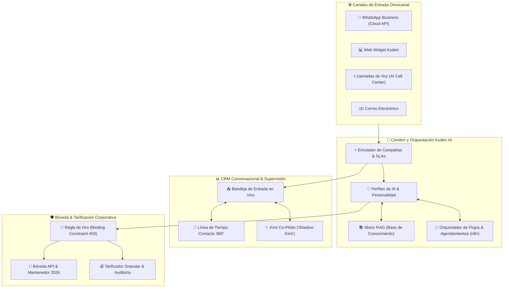
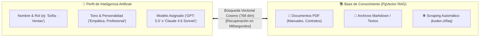
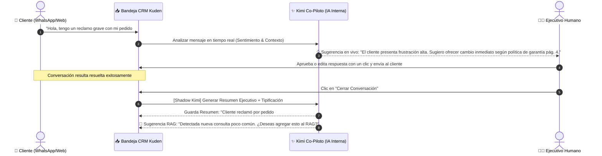
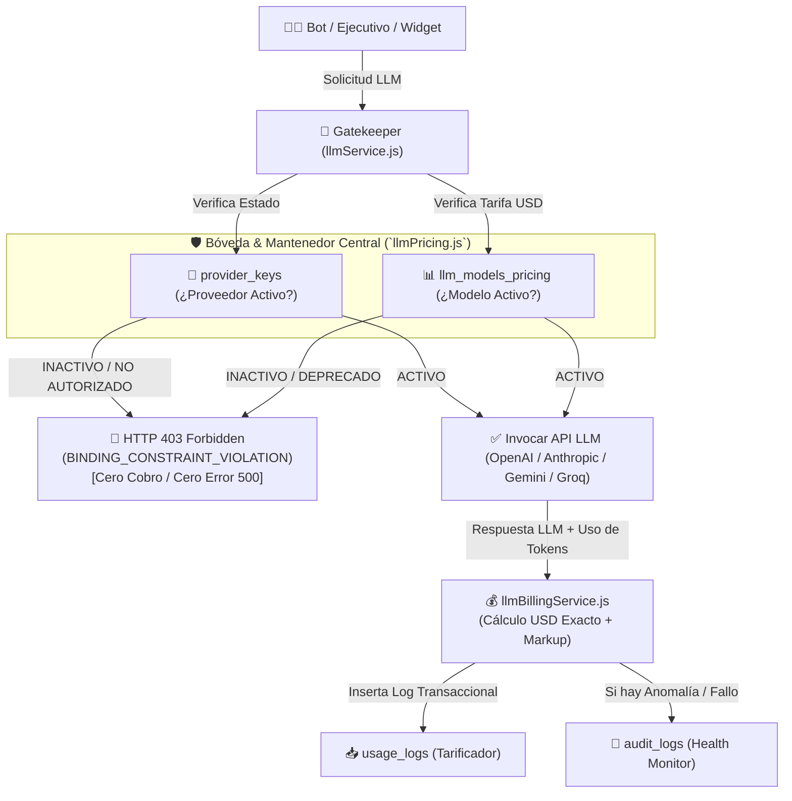
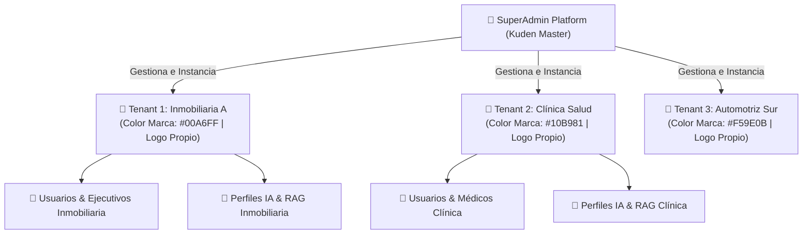

# Manual Operativo y Radiografía Integral de la Plataforma Kuden IA
*El Ecosistema Omnicanal Inteligente, CRM Conversacional 360° y Bóveda Corporativa de Inteligencia Artificial*

---

> [!IMPORTANT]
> **Acerca de este Documento:**
> Este manual ha sido diseñado como una **radiografía completa y transparente** del ecosistema **Kuden IA**. Su doble enfoque permite que **clientes, gerentes y operadores** comprendan el funcionamiento cotidiano y paso a paso de cada módulo en un lenguaje claro y accesible, mientras que los recuadros estratégicos de **✨ Valor Comercial y Marketing** y **⚙️ Arquitectura/TI** proporcionan el contenido exacto y de alto impacto listo para ser integrado en páginas web institucionales, propuestas comerciales y presentaciones técnicas.

---

## 📑 Tabla de Contenidos

1. [Filosofía del Ecosistema y Visión General](#1-filosofía-del-ecosistema-y-visión-general)
2. [Arquitectura Omnicanal y Canales de Comunicación](#2-arquitectura-omnicanal-y-canales-de-comunicación)
   - [WhatsApp Business (Meta Cloud API Oficial)](#21-whatsapp-business-meta-cloud-api-oficial)
   - [Web Widget Inteligente (Chat incrustable)](#22-web-widget-inteligente-chat-incrustable)
   - [Call Center IA y Agentes de Voz (Webhooks de Voz)](#23-call-center-ia-y-agentes-de-voz-webhooks-de-voz)
   - [Ticketing por Correo Electrónico](#24-ticketing-por-correo-electrónico)
3. [El Cerebro Conversacional: Perfiles IA y Base de Conocimiento (RAG)](#3-el-cerebro-conversacional-perfiles-ia-y-base-de-conocimiento-rag)
   - [Gestión de Perfiles IA y Personalidad](#31-gestión-de-perfiles-ia-y-personalidad)
   - [Motor RAG Multi-Fuente (PDFs, Markdown y Scraping Web)](#32-motor-rag-multi-fuente-pdfs-markdown-y-scraping-web)
4. [Inteligencia Interna Kuden: Kimi Co-Piloto e Identidad Maestra](#4-inteligencia-interna-kuden-kimi-co-piloto-e-identidad-maestra)
   - [Kimi Co-Piloto en Vivo ("Shadow Kimi")](#41-kimi-co-piloto-en-vivo-shadow-kimi)
   - [Analista de Resúmenes y Tipificación Automática](#42-analista-de-resúmenes-y-tipificación-automática)
   - [Sugeridor de Aprendizaje Auto-didacta (RAG Suggestions)](#43-sugeridor-de-aprendizaje-auto-didacta-rag-suggestions)
5. [CRM Conversacional y Línea de Tiempo 360° Omnicanal](#5-crm-conversacional-y-línea-de-tiempo-360-omnicanal)
   - [Bandeja de Entrada en Vivo y Traspaso Humano](#51-bandeja-de-entrada-en-vivo-y-traspaso-humano)
   - [Expediente del Contacto 360° y Detección de Fugas](#52-expediente-del-contacto-360-y-detección-de-fugas)
6. [Gestión de Campañas, Herramientas IA (Tools) y Orquestación n8n](#6-gestión-de-campañas-herramientas-ia-tools-y-orquestación-n8n)
   - [Campañas, Enrutamiento y SLAs](#61-campañas-enrutamiento-y-slas)
   - [Herramientas de IA (Function Calling) y Delegación a n8n](#62-herramientas-de-ia-function-calling-y-delegación-a-n8n)
7. [Bóveda de Seguridad, Tarificador Corporativo y Observabilidad](#7-bóveda-de-seguridad-tarificador-corporativo-y-observabilidad)
   - [Bóveda Central API (`provider_keys`) y Mantenedor de Modelos (`llm_models_pricing`)](#71-bóveda-central-api-y-mantenedor-de-modelos)
   - [La Regla de Oro de Seguridad (Binding Constraint - 403 Forbidden)](#72-la-regla-de-oro-de-seguridad-binding-constraint)
   - [Tarificador Granular y Control de Márgenes (`BillingDashboard`)](#73-tarificador-granular-y-control-de-márgenes)
   - [Observabilidad y Diagnóstico (`Health Monitor`)](#74-observabilidad-y-diagnóstico-health-monitor)
8. [Atribución de Marketing (Kuden Ads) y Automatización Social](#8-atribución-de-marketing-kuden-ads-y-automatización-social)
9. [Administración Multi-Empresa (Tenants) y White-Labeling](#9-administración-multi-empresa-tenants-y-white-labeling)
10. [Guía Rápida de Puesta en Marcha (15 Minutos)](#10-guía-rápida-de-puesta-en-marcha-15-minutos)
11. [Glosario Técnico y Operativo](#11-glosario-técnico-y-operativo)

---

## 1. Filosofía del Ecosistema y Visión General

**Kuden IA** no es un simple *chatbot* ni una interfaz aislada. Es una **plataforma corporativa integral** diseñada para actuar como el sistema nervioso central de la atención al cliente, las ventas y el soporte técnico en organizaciones modernas. 

El sistema resuelve el problema histórico de la fragmentación en la atención: unifica en una sola pantalla los mensajes de WhatsApp, el chat de la página web, los correos electrónicos y las llamadas telefónicas de voz, permitiendo que tanto **Agentes de Inteligencia Artificial de última generación** como **Ejecutivos Humanos** colaboren de manera fluida, sin pérdida de contexto ni tiempos muertos.

### Principios Fundamentales de la Plataforma
1. **Atención Continua 24/7 sin Pérdida de Calidad:** La IA atiende de forma instantánea el 100% de las consultas iniciales, resolviendo hasta un 85% de los requerimientos repetitivos y calificando a los prospectos antes de pasarlos a un humano.
2. **Arquitectura Cero Reinvención (`Zero-Reinvention Rule`):** Kuden IA no intenta reinventar herramientas que ya dominan el mercado (como calendarios o sistemas de facturación de terceros). Para agendamientos, consultas de stock o cruces con ERPs, el sistema delega la ejecución transaccional a **n8n**, conectando nativamente con Google Calendar, Outlook, Salesforce, SAP o cualquier API REST.
3. **Seguridad y Transparencia Financiera Absoluta:** Ningún modelo u operación corre peligro de generar costos ocultos. Gracias a la **Bóveda Central** y la **Regla de Oro de Seguridad**, la plataforma controla cada fracción de centavo invertida en Inteligencia Artificial.

---

## 2. Arquitectura Omnicanal y Canales de Comunicación

La plataforma está diseñada para que el cliente final se comunique por el canal que le resulte más cómodo, mientras que el equipo de atención gestiona todo desde una única interfaz homogénea.

### 2.1. WhatsApp Business (Meta Cloud API Oficial)
Conexión directa con la infraestructura oficial de Meta (Facebook/Instagram/WhatsApp), garantizando máxima estabilidad, cumplimiento con las políticas de privacidad internacional y cero riesgo de bloqueos por uso de APIs no oficiales.

*   **¿Cómo funciona para el operador?** Todos los mensajes de WhatsApp llegan en milisegundos a la bandeja de entrada (`Inbox`). Si un cliente envía una nota de voz, **el transcribidor automático (Whisper) la convierte en texto al instante**, permitiendo a la IA leerla y responder en segundos, o al ejecutivo humano leerla sin necesidad de escuchar el audio en ambientes ruidosos.
*   **Plantillas y Botones:** Permite disparar plantillas de notificación oficiales aprobadas por Meta (recordatorios de cita, avisos de cobranza, confirmaciones de pedido) con botones interactivos de respuesta rápida.

> [!TIP]
> **✨ Valor Comercial y Marketing (Para Sitio Web):**
> *"Convierte tu canal de WhatsApp en una máquina de ventas 24/7. Olvídate de los bots robóticos de opciones numéricas ('presione 1, presione 2'). Con Kuden IA en WhatsApp, tus clientes conversan de forma natural por texto o audios de voz, recibiendo respuestas precisas, cotizaciones en línea y agendamientos confirmados directamente en su chat favorito."*

> [!NOTE]
> **⚙️ Arquitectura/TI:**
> Integración basada en Webhooks autenticados de Meta Cloud API v19+. Soporta procesamiento asíncrono de adjuntos (imágenes, documentos PDF, audios OGG/MP3), mapeo dinámico de números telefónicos por empresa (`tenant_id`) y reconexión automática ante cortes de red.

---

### 2.2. Web Widget Inteligente (Chat incrustable)
El **Kuden Widget** (`WidgetSettings.jsx`) es una ventana de chat flotante altamente estética y personalizable que se instala en cualquier página web (WordPress, Shopify, React, HTML estático) pegando una sola línea de código JavaScript (``).

*   **¿Cómo funciona para el operador?** Desde el panel de administración, puedes modificar en tiempo real los colores del widget para que coincidan con tu manual de marca, definir el saludo de bienvenida, configurar preguntas iniciales de captura de leads (Nombre, Correo, Teléfono) y vincularlo a un Perfil de IA específico.
*   **Soporte RAG Instantáneo:** Mientras el visitante navega por la página, puede preguntar cualquier detalle sobre precios, políticas de devolución o manuales de producto, y la IA responderá basándose en la documentación interna con precisión quirúrgica.

> [!TIP]
> **✨ Valor Comercial y Marketing (Para Sitio Web):**
> *"Transforma a los visitantes de tu sitio web en compradores. Nuestro Widget Inteligente no solo saluda: comprende la intención del usuario, responde dudas complejas sobre tus catálogos de productos en tiempo real y califica la oportunidad comercial antes de transferirla al equipo de ventas con el historial completo."*

---

### 2.3. Call Center IA y Agentes de Voz (Webhooks de Voz)
La voz sigue siendo el canal preferido para emergencias, soporte complejo y cierres de alta confianza. Kuden IA cuenta con un módulo dedicado (`VoiceWebhookSettings.jsx`) capaz de integrarse con motores de telefonía inteligente y agentes de voz de vanguardia (Vapi, Retell AI, Twilio Voice).

*   **¿Cómo funciona para el operador?** Cuando un cliente llama por teléfono a tu número corporativo y es atendido por un Agente de Voz IA, o cuando un ejecutivo realiza una llamada desde la plataforma, el sistema procesa la llamada en segundo plano. Al terminar la llamada, **el resumen ejecutivo, la transcripción completa palabra por palabra y el enlace de grabación de audio (MP3)** se inyectan automáticamente en la línea de tiempo del cliente dentro del CRM.

> [!TIP]
> **✨ Valor Comercial y Marketing (Para Sitio Web):**
> *"El Call Center del futuro ya está aquí. Conecta llamadas telefónicas con Inteligencia Artificial conversacional capaz de resolver dudas con voz humana, cálida y natural. Cada llamada queda transcrita, analizada en su sentimiento y resumida automáticamente en el expediente del cliente dentro de tu CRM Kuden."*

---

### 2.4. Ticketing por Correo Electrónico
Para procesos de soporte formal o cotizaciones corporativas extensas, el módulo de cuentas de correo (`EmailAccountsManager.jsx`) centraliza la recepción de correos en la misma lógica conversacional. Cada hilo de correo se convierte en un ticket donde la IA puede sugerir borradores formales de respuesta o adjuntar documentación técnica al instante.

---

## 3. El Cerebro Conversacional: Perfiles IA y Base de Conocimiento (RAG)

El verdadero diferencial de Kuden IA radica en la separación inteligente entre la **Personalidad del Bot (`Perfiles IA`)** y su **Conocimiento Corporativo (`Base de Conocimiento RAG`)**.

### 3.1. Gestión de Perfiles IA y Personalidad
En la sección **Perfiles IA** (`ProfilesManager.jsx`), los administradores pueden crear ilimitados asistentes virtuales especializados para distintas áreas de la empresa (ej. un perfil para Soporte Técnico, otro para Ventas y otro para Cobranzas).

*   **Configuración del Prompt del Sistema (System Prompt):** Defines con precisión quién es el bot, qué debe responder, qué límites no puede cruzar (ej. *"Nunca ofrezcas descuentos mayores al 10%"*) y cómo debe manejar situaciones difíciles.
*   **Elección Granular del Modelo LLM:** Puedes asignar a cada perfil el motor de inteligencia artificial que mejor se adapte a su misión y presupuesto:
    *   **Modelos Flagship / Inteligencia Máxima:** `OpenAI GPT-5.5`, `Claude Opus 4.8`, `Gemini 3.1 Pro Preview`. Ideales para razonamiento complejo, análisis legal o cotizaciones estructuradas.
    *   **Modelos Rápidos / Balanceados:** `GPT-5.4 Mini`, `Claude Haiku 4.5`, `Gemini 3.5 Flash`, `Llama 4 70B (Groq)`. Perfectos para respuestas instantáneas de preguntas frecuentes (FAQs) con un costo extremadamente bajo.

---

### 3.2. Motor RAG Multi-Fuente (PDFs, Markdown y Scraping Web)
Para que un asistente de Inteligencia Artificial sea verdaderamente útil, debe conocer a fondo los secretos, catálogos, tarifas y regulaciones internas de tu empresa. Eso es exactamente lo que hace el módulo de **Base de Conocimiento (RAG - *Retrieval-Augmented Generation*)** (`KnowledgeBaseManager.jsx`).

*   **¿Cómo funciona para el operador?** Entras al módulo y subes directamente tus archivos:
    1.  **PDFs:** Manuales de usuario, catálogos de productos, pólizas de garantía o contratos formales.
    2.  **Archivos Markdown (.md) y Texto:** Guías de procedimientos rápidos o notas operativas.
    3.  **Scraping de Sitios Web:** Ingresas la URL de tu página de preguntas frecuentes (ej. `https://tuempresa.com/ayuda`) y el sistema extrae automáticamente todo el texto de la web.
*   **Procesamiento Vectorial:** En el backend (`ragService.js`), el sistema divide los documentos en fragmentos semánticos (*chunks*), genera vectores matemáticos de 768 dimensions y los indexa en la base de datos `PgVector`.
*   **Cero Alucinaciones:** Cuando un cliente pregunta algo, la IA busca en milisegundos los párrafos exactos dentro de tu base de conocimiento, extrae la respuesta real de tu empresa y cita la información con absoluta fidelidad.

> [!TIP]
> **✨ Valor Comercial y Marketing (Para Sitio Web):**
> *"Haz que tu IA domine el 100% de la información de tu empresa. Sube tus catálogos en PDF o el enlace de tu sitio web, y nuestro motor de Búsqueda Vectorial (RAG) aprenderá todo tu negocio en minutos. Despídete de las respuestas genéricas o alucinaciones: tu bot responderá como tu empleado más experto."*

> [!NOTE]
> **⚙️ Arquitectura/TI:**
> Motor vectorial impulsado por la extensión `vector` de PostgreSQL (PgVector) en Supabase. Utiliza similitud del coseno sobre representaciones de 768 dimensiones. La fragmentación heurística (`chunking`) respeta saltos de párrafo y semántica de tablas para evitar cortes de contexto críticos en documentos extensos.

---

## 4. Inteligencia Interna Kuden: Kimi Co-Piloto e Identidad Maestra

Además de atender a los clientes externos, Kuden IA cuenta con una **Identidad Maestra de Inteligencia Interna llamada "Kimi"** (`AIConfigManager.jsx`, `CopilotManager.jsx`, `KimiInsights.jsx`). Kimi es la IA invisible que trabaja de la mano con tu equipo humano para multiplicar su productivity.

### 4.1. Kimi Co-Piloto en Vivo ("Shadow Kimi")
Cuando un ejecutivo humano toma el control de un chat difícil, **Kimi Co-Piloto** lee silenciosamente en la barra lateral el historial completo y sugiere en tiempo real la mejor respuesta técnica, comercial o diplomática.

*   **¿Cómo beneficia al ejecutivo?** En lugar de redactar desde cero respuestas largas o buscar en carpetas dónde está el procedimiento de devolución, el ejecutivo ve la sugerencia de Kimi, la aprueba con un clic (o la ajusta ligeramente) y la envía al cliente en segundos. Esto reduce el **Tiempo Medio de Operación (AHT)** en más de un 60%.

---

### 4.2. Analista de Resúmenes y Tipificación Automática
Uno de los mayores dolores de cabeza en los *call centers* es el tiempo que pierden los agentes redactando notas o resúmenes manuales después de terminar cada llamada o chat ("Trabajo After-Call").

*   **Cierre Inteligente:** En Kuden IA, cuando el ejecutivo hace clic en **"Cerrar Conversación"**, el módulo **Analista de Resúmenes (`Shadow Kimi`)** se activa automáticamente en el backend (`generateExecutiveSummary`).
*   **Resumen Instantáneo:** La IA lee todo el historial omnicanal, redacta un resumen ejecutivo limpio de 3 líneas con los acuerdos alcanzados y asigna automáticamente la **Tipificación del CRM** (ej. `Soporte > Garantía > Resuelto`), guardándolo de forma permanente en la ficha del contacto.

---

### 4.3. Sugeridor de Aprendizaje Auto-didacta (RAG Suggestions)
El ecosistema no es estático; aprende de la experiencia cotidiana. Mediante el gancho de innovación `generateRAGSuggestion`, al cerrarse un ticket, Kimi analiza si el cliente hizo una pregunta cuya respuesta **no estaba previamente en la Base de Conocimiento RAG** y que requirió investigación del humano.
Si detecta un vacío de información, Kimi genera una **Sugerencia de RAG** automática y la envía al administrador con el mensaje: *"Hoy respondieron exitosamente cómo instalar el repuesto X-90. ¿Deseas indexar esta respuesta al RAG para que el bot la responda solo la próxima vez?"*. Con un solo clic, la base de conocimiento se actualiza.

> [!TIP]
> **✨ Valor Comercial y Marketing (Para Sitio Web):**
> *"Tu equipo de soporte con un superpoder de inteligencia. Kimi Co-Piloto asiste a tus ejecutivos humanos en vivo, redacta los resúmenes post-atención de forma automática y aprende de cada caso cerrado para que tu empresa sea más inteligente cada día."*

---

## 5. CRM Conversacional y Línea de Tiempo 360° Omnicanal

La bandeja de entrada operativa (`CRMManager.jsx` e `Inbox`) está diseñada bajo criterios de ergonomía visual y velocidad de respuesta para equipos de alto rendimiento.

### 5.1. Bandeja de Entrada en Vivo y Traspaso Humano
El área de trabajo clasifica las conversaciones en tres pestañas claras:
1.  **Atendido por IA:** Chats en los que el bot conversacional está respondiendo de forma autónoma al cliente en tiempo real.
2.  **Abiertos / Asignados:** Chats donde un ejecutivo humano ha intervenido haciendo clic en **"Tomar Conversación"** (`action_lock`), pausando temporalmente al bot para atender de forma personal.
3.  **En Espera / Resueltos:** Tickets pendientes de respuesta por parte del cliente o archivados exitosamente con su respectivo resumen Kimi.

*   **Traspaso sin Fricción:** Si el cliente solicita explícitamente *"quiero hablar con un humano"* o la IA detecta que la consulta supera su umbral de certeza, el bot transfiere el chat a la cola humana adjuntando una nota interna: *"🔴 Traspaso prioritario: Cliente desea consultar condiciones especiales de crédito"*.

---

### 5.2. Expediente del Contacto 360° y Detección de Fugas (`Contact360View`)
Al hacer clic en cualquier conversación o contacto (`ContactsManager.jsx`), se despliega la **Vista 360° Omnicanal (`Contact360View.jsx`)**. Esta pantalla es el santo grial de la fidelización de clientes.

*   **Línea de Tiempo Histórica Unificada:** Muestra de forma cronológica absolutamente todas las interacciones pasadas del cliente, sin importar si ocurrieron ayer por **WhatsApp**, hace dos semanas por el **Web Widget** o hace tres meses en una **Llamada Telefónica de Voz**. El ejecutivo ve el contexto íntegro en un solo scroll.
*   **Termómetro de Satisfacción y CSAT Histórico (`nps_historico`):** El sistema calcula y muestra el promedio de satisfacción global del cliente basándose en el análisis de sentimiento de sus interacciones previas.
*   **Alerta de Riesgo de Fuga ("Fuga" vs "Retenido"):** Si un cliente ha acumulado menciones negativas, quejas reiteradas o palabras clave como *"cancelar servicio"* o *"ir a la competencia"*, el sistema etiqueta el contacto con un badge rojo de **🔥 RIESGO DE FUGA ALTO**. Si el ejecutivo interviene y soluciona el problema satisfactoriamente, el sistema transiciona automáticamente el estado a **🛡️ RETENIDO**, permitiendo a la gerencia medir las tasas de salvamento de clientes en riesgo.

> [!TIP]
> **✨ Valor Comercial y Marketing (Para Sitio Web):**
> *"Conoce a tu cliente antes de decir 'Hola'. Nuestra Vista 360° unifica el historial completo de WhatsApp, Chat Web y Voz en una sola línea de tiempo. Además, nuestra IA analiza el sentimiento de cada conversación para avisarte al instante qué clientes están en riesgo de abandonar tu empresa, permitiéndote retenerlos a tiempo."*

---

## 6. Gestión de Campañas, Herramientas IA (Tools) y Orquestación n8n

Para organizaciones multi-área o con procesos transaccionales avanzados, el módulo de **Campañas (`CampaignsManager.jsx`)** actúa como el director de orquesta.

### 6.1. Campañas, Enrutamiento y SLAs
Una **Campaña** representa una línea de negocio o departamento (ej. *Campaña de Soporte Técnico*, *Campaña de Ventas Mayoristas*, *Campaña de Cobranza Temprana*).

*   **Asignación de Bot o Equipo:** Cada campaña puede tener asignado un **Perfil de IA propio** (ej. el bot de ventas es proactivo y persuasivo, el de soporte es formal y metódico) y un grupo específico de **Ejecutivos Humanos** autorizados para responder esa cola.
*   **Control de SLAs (Acuerdos de Nivel de Servicio):** Puedes configurar semáforos de tiempo máximo de espera. Si un cliente en la campaña de soporte lleva más de 5 minutos sin respuesta humana (tras pedir traspaso), la plataforma alerta visualmente al supervisor para evitar incumplimientos de SLA.

---

### 6.2. Herramientas de IA (Function Calling) y Delegación a n8n
Este es el punto de máxima sofisticación tecnológica del proyecto. Siguiendo la **Regla de Cero Reinvención (`Zero-Reinvention Rule`)**, cuando el cliente necesita que la IA realice una acción ejecutiva real —como agendar una reunión en el calendario, verificar stock de un producto en bodega o consultar el saldo adeudado en el ERP—, la IA utiliza **Herramientas (Tools / Function Calling)** conectadas a **n8n**.

*   **¿Cómo se configura en la plataforma?** En `CampaignsManager.jsx`, creas una Herramienta definiendo su nombre (ej. `agendar_cita_calendario`) y los datos que la IA debe extraer de la conversación (`nombre_cliente`, `fecha_hora`, `correo`). Luego pegas la URL del Webhook de tu flujo en **n8n**.
*   **Ejecución Mágica en Milisegundos:**
    1.  El cliente dice en WhatsApp: *"Quiero agendar una visita técnica para el próximo jueves a las 11 AM"*.
    2.  La IA extrae inteligentemente los parámetros y dispara el Webhook hacia **n8n**.
    3.  **n8n** se conecta al Google Calendar u Outlook de tu empresa, verifica si la hora está disponible, agenda el evento y devuelve la confirmación.
    4.  La IA responde al cliente con el tono del bot: *"¡Listo! He reservado tu visita técnica para el jueves 16 a las 11:00 AM. Te enviamos una invitación a tu correo."*

> [!TIP]
> **✨ Valor Comercial y Marketing (Para Sitio Web):**
> *"Mucho más que conversación: verdadera acción ejecutiva. Conecta tu IA corporativa con tus calendarios, sistemas ERP (SAP, Salesforce) o inventarios a través de nuestro puente nativo con n8n. Tu asistente virtual no solo informa: cotiza, reserva horas, verifica estados de cuenta y ejecuta procesos complejos las 24 horas."*

> [!NOTE]
> **⚙️ Arquitectura/TI:**
> Soporte nativo del estándar `Function Calling` de OpenAI, Anthropic y Gemini. El backend orquesta la interrupción de la generación de texto (`finish_reason: tool_calls`), emite la petición HTTP POST hacia el webhook externo (n8n o API propia) portando el *payload* JSON estructurado e inyecta la salida (`tool_response`) en el contexto del LLM para completar la respuesta final.

---

## 7. Bóveda de Seguridad, Tarificador Corporativo y Observabilidad

En los sistemas de Inteligencia Artificial convencionales, el manejo de llaves API y costos suele ser una caja negra propensa a gastos descontrolados, errores 500 y falta de gobernanza. Kuden IA cuenta con un estándar corporativo de seguridad y auditoría financiera que lo distingue a nivel empresarial.

### 7.1. Bóveda Central API (`provider_keys`) y Mantenedor de Modelos (`llm_models_pricing`)
En el módulo **Gestión APIs y LLM (`GlobalKeysManager.jsx`)**, el SuperAdmin administra de forma centralizada todas las llaves de inteligencia artificial del sistema.

*   **Pestaña 1: Bóveda Central API (`provider_keys`):** Almacenas las llaves maestras para cada proveedor oficial (`anthropic`, `openai`, `gemini`, `groq`, `openrouter`). Puedes pausar un proveedor entero con un interruptor (`is_active: false`) si se detecta mantenimiento o contingencia externa.
*   **Pestaña 2: Mantenedor de Modelos (`llm_models_pricing`):** El catálogo oficial de Kuden QA con todas las tarifas 2026. Aquí defines el Nombre Técnico del modelo (ej. `claude-sonnet-4-6`), el Nombre Amigable con el que lo verán tus clientes en los selectores (ej. *"Claude 4.6 Sonnet - Balanceado"*), el costo exacto por 1 Millón de tokens de entrada (`prompt_rate`) y de salida (`completion_rate`), y su estado de activación (`is_active`).
*   **Auto-Población Inteligente (Auto-Seed 2026):** Si un cliente entra a la plataforma y por alguna razón la tabla de su base de datos no tiene cargados los modelos de última generación (`gpt-5.5`, `gpt-5.4`, `claude-sonnet-4-6`, `gemini-3.1-pro-preview`, `llama-4-70b-8192`), **el backend realiza automáticamente un `upsert` silencioso sin duplicar**, poblando el catálogo y garantizando que los selectores jamás se queden obsoletos ni caigan a versiones antiguas.

---

### 7.2. La Regla de Oro de Seguridad (`Binding Constraint - 403 Forbidden`)
Para evitar que algún usuario intente forzar por código el uso de un modelo experimental costoso, o que un error de configuración rompa el sistema con una pantalla blanca de error 500, Kuden IA aplica en el backend (`llmService.js`) la **Regla de Oro de Seguridad (Binding Constraint)**:

1.  **Intercepción Pre-Vuelo:** Antes de que el servidor envíe un solo byte a OpenAI o Anthropic, verifica transaccionalmente en la Bóveda Central si el proveedor y el modelo solicitados tienen `is_active = true`.
2.  **Bloqueo Diplomático HTTP 403:** Si el modelo está inactivo, deprecado o desautorizado, el Gatekeeper interrumpe de inmediato el flujo arrojando un error **`403 Forbidden`** (`BINDING_CONSTRAINT_VIOLATION`). En lugar de un error catastrófico 500, el CRM y el Widget reciben un JSON controlado que advierte diplomáticamente al operador: *"⚠️ El modelo seleccionado se encuentra inactivo por seguridad administrativa"*.

---

### 7.3. Tarificador Granular y Control de Márgenes (`BillingDashboard`)
El **Tarificador Corporativo (`BillingDashboard.jsx`)** es la pantalla donde los administradores y agencias supervisan al centavo la rentabilidad y el gasto de Inteligencia Artificial.

*   **Desglose Transaccional en Vivo:** Cada vez que el bot responde un mensaje web o vectoriza un PDF, el servicio `llmBillingService.js` calcula la tarifa matemática exacta en USD (`(prompt_tokens * prompt_rate + completion_tokens * completion_rate) / 1,000,000`) e inserta un registro en la tabla `usage_logs`.
*   **Control de Margen Comercial (Markup Multiplier):** Permite a las agencias o empresas aplicar un multiplicador comercial sobre el costo neto del API (ej. `llm_markup_multiplier = 1.5`), diferenciando con total claridad el **Costo Neto API (`cost_usd`)** del **Costo Facturado al Cliente (`billed_usd`)** en las métricas y exportaciones CSV.
*   **Resiliencia Total (`select('*')` & `normalizeLogItem`):** La interfaz está programada de forma tan robusta que es inmune a variaciones en nombres de columnas entre bases de datos, homologando al instante cualquier formato (`model` vs `model_name`, `source` vs `feature_type`) para una experiencia visual sin errores ni pantallas en blanco.

---

### 7.4. Observabilidad y Diagnóstico (`Health Monitor`)
El panel **Health Monitor (`SystemHealthDashboard.jsx`)** es la torre de control de salud del sistema.

*   **Bitácora de Auditoría (`audit_logs`):** Todo intento bloqueado por la Regla de Oro (Gatekeeper 403), caída externa de los servidores de Meta/Google o error en un Webhook de n8n queda registrado aquí automáticamente con severidad `error`, `warning` o `info`.
*   **Diagnóstico Preventivo:** Permite al equipo técnico identificar cuellos de botella, latencias de red o límites de cuota (`Rate Limits`) antes de que el cliente final perciba una degradación en el servicio.

> [!TIP]
> **✨ Valor Comercial y Marketing (Para Sitio Web):**
> *"Control total y previsibilidad financiera. Nuestra Bóveda Central y Tarificador Corporativo te permiten supervisar al centavo el consumo de tokens y costos en dólares de tu Inteligencia Artificial por cada departamento o canal. Con nuestro Gatekeeper de Seguridad 403, tu presupuesto está 100% blindado contra fugas, modelos inactivos o consumos desautorizados."*

---

## 8. Atribución de Marketing (Kuden Ads) y Automatización Social

Kuden IA cierra el círculo entre la inversión en publicidad pagada (Meta Ads, Google Ads) y los resultados reales obtenidos dentro del CRM.

### 8.1. Conversiones Offline (Meta CAPI & Google Ads)
Cuando una empresa invierte miles de dólares en anuncios en Facebook o Google para traer conversaciones de WhatsApp al CRM, el mayor problema es que el algoritmo publicitario no sabe qué conversaciones fueron curiosos sin dinero y cuáles se convirtieron en clientes reales.

*   **Retroalimentación al Algoritmo:** Con la integración de Atribución de Marketing de Kuden IA (`Meta_Tech_Provider_Roadmap.md`), cuando un ejecutivo humano o la IA cierra un negocio en el CRM y le asigna la tipificación *"✅ Venta Cerrada - $500 USD"*, **la plataforma envía automáticamente ese evento de conversión de regreso a la API de Conversiones de Meta (CAPI) y Google Ads**.
*   **Optimización del ROAS:** Al recibir la señal de una venta real, el algoritmo de inteligencia artificial de Meta/Google optimiza sus campañas para mostrar tus anuncios exactamente a personas con el mismo perfil del comprador real, multiplicando el Retorno sobre la Inversión Publicitaria (ROAS).

---

### 8.2. Comentarios a DMs en Instagram (AI Comments-to-DM)
Soporte automatizado para capturar oportunidades desde publicaciones virales en redes sociales. Si un usuario comenta *"Precio"* o *"Info"* en un reel o post de Instagram de tu marca, la IA le responde con un comentario público de cortesía y de forma simultánea le abre una conversación por **Mensaje Directo (DM)**, iniciando el embudo de calificación y agendamiento en segundos.

> [!TIP]
> **✨ Valor Comercial y Marketing (Para Sitio Web):**
> *"Conecta tu pauta publicitaria con tus ventas reales. Nuestra plataforma retroalimenta de forma directa a Meta CAPI y Google Ads cada vez que tu IA o equipo comercial cierra un negocio en el CRM. Tu inversión en marketing aprende en automático a traerte clientes calificados de alto valor, no solo clics."*

---

## 9. Administración Multi-Empresa (Tenants) y White-Labeling

Para agencias de marketing, corporaciones multi-marca o empresas con múltiples sucursales, Kuden IA incorpora una arquitectura **Multi-Tenant (Multi-Inquilino) y White-Label (`TenantsManager.jsx`, `UsersManager.jsx`, `UserProfile.jsx`)**.

*   **Aislamiento Estricto de Datos (Row-Level Security):** Cada *Tenant* o empresa cuenta con sus propios contactos, perfiles de IA, bases de conocimiento RAG, campañas e integraciones de WhatsApp completamente aislados. Un ejecutivo de la Empresa A jamás podrá acceder ni visualizar los datos o chats de la Empresa B.
*   **Personalización de Marca (White-Label Dinámico por CSS variables):** Desde el panel de `TenantsManager.jsx`, puedes subir el logotipo oficial de cada cliente y definir su Color de Marca (`brandColor`). Toda la interfaz (barras laterales, botones activos, acentos de selección, widgets y reportes) transiciona dinámicamente mediante propiedades CSS de vanguardia (`--color-brand`, `color-mix()`), brindando una experiencia 100% corporativa y coherente con la identidad de cada marca.
*   **Roles de Seguridad y Control de Acceso (`UsersManager.jsx`):**
    *   **SuperAdmin:** Control global del ecosistema, creación de empresas (*Tenants*), acceso a Bóveda Central y Tarificador Maestro.
    *   **Admin de Empresa:** Control total dentro de su *Tenant*. Puede crear usuarios, configurar perfiles IA, subir archivos RAG y administrar webhooks.
    *   **Ejecutivo / Agente:** Acceso optimizado para la atención cotidiana en la bandeja de entrada CRM (`Inbox`), vista de contactos y herramientas analíticas asignadas.

---

## 10. Guía Rápida de Puesta en Marcha (15 Minutos)

¿Acabas de crear una nueva empresa o *Tenant* en Kuden IA? Sigue este flujo paso a paso para poner tu asistente omnicanal y CRM en producción en menos de 15 minutos:

| Paso | Módulo | Acción Operativa Paso a Paso | Tiempo Estimado |
| :---: | :--- | :--- | :---: |
| **1️⃣** | **Gestión APIs y LLM** (`GlobalKeysManager`) | Entra a la pestaña **Bóveda Central API**, verifica que el proveedor que deseas usar (ej. `Anthropic` o `OpenAI`) esté con `is_active = true`. Luego ve al **Mantenedor de Modelos** y confirma que el modelo de tu elección (ej. `claude-sonnet-4-6` o `gpt-5.5`) esté activo. | **2 min** |
| **2️⃣** | **Perfiles IA** (`ProfilesManager`) | Haz clic en **+ Nuevo Perfil**. Asígnale un nombre (ej. *"Asistente de Ventas"*), selecciona el proveedor y el modelo activo del Paso 1, y redacta las instrucciones de personalidad y límites en el **System Prompt**. Guarda los cambios. | **3 min** |
| **3️⃣** | **Base de Conocimiento RAG** (`KnowledgeBaseManager`) | Entra a la sección RAG. Sube el catálogo de productos o manual de servicios de tu empresa en formato **PDF** o pega la URL de tus preguntas frecuentes web para indexarlas con un clic. Espera a que el indicador vectorial marque **"100% Indexado"**. | **3 min** |
| **4️⃣** | **Campañas y n8n** (`CampaignsManager`) | Crea una nueva **Campaña** (ej. *"Atención General"*). Elígele un color distintivo, asígnale el **Perfil de IA** creado en el Paso 2 y selecciona al equipo de ejecutivos humanos que recibirá los traspasos. *(Opcional: Si deseas que agende citas, vincula aquí tu Webhook de n8n en la sección Herramientas)*. | **4 min** |
| **5️⃣** | **Conexión de Canales** (`WidgetSettings` / `IntegrationsHub`) | **Para Web:** Ve a **Configuración de Widget**, personaliza el saludo, vincula tu Campaña y copia el código `<script>` en tu página web. **Para WhatsApp:** Entra al **Hub de Integraciones**, conecta tu número con Meta Cloud API y selecciona tu Campaña como destino predeterminado. | **3 min** |

> [!IMPORTANT]
> **¡Listo para Operar!** Tus clientes ya pueden escribir por WhatsApp o el Widget Web, recibiendo atención instantánea por IA enriquecida con tu conocimiento documental y respaldada por tu equipo humano en la bandeja de entrada CRM.

---

## 11. Glosario Técnico y Operativo

Para facilitar el diálogo entre áreas comerciales, administrativas y de ingeniería, presentamos las definiciones de los conceptos centrales del ecosistema Kuden IA:

*   **API (Application Programming Interface):** Puente de comunicación digital seguro que permite a Kuden IA conectarse de forma estandarizada con sistemas externos como WhatsApp de Meta, motores de inteligencia artificial de Anthropic o automatizadores como n8n.
*   **Token / Costo por 1M Tokens:** Unidad de medida básica de texto en Inteligencia Artificial (aproximadamente equivale a 3 o 4 caracteres o tres cuartos de una palabra en español). Los proveedores facturan sus modelos en base a cuántos millones de tokens ingresan en la pregunta (`Prompt Tokens`) y cuántos se generan en la respuesta (`Completion Tokens`).
*   **RAG (Retrieval-Augmented Generation / Generación Aumentada por Recuperación):** Arquitectura avanzada donde la IA, en lugar de improvisar o responder de memoria, realiza primero una búsqueda matemática instantánea dentro de tus documentos oficiales (PDFs, Markdown) para construir una respuesta 100% verificable y sin alucinaciones.
*   **Embedding / PgVector (768 Dimensiones):** Proceso mediante el cual los textos y párrafos de tus documentos se convierten en coordenadas matemáticas numéricas (vectores) dentro de la base de datos PostgreSQL de Kuden, permitiendo comparar significados y conceptos (no solo palabras exactas) con una precisión y velocidad asombrosas.
*   **Gatekeeper / Binding Constraint (Error 403):** Mecanismo de seguridad interna en Kuden IA que actúa como un guardia de tránsito transaccional. Si una solicitud intenta usar una llave o un modelo de IA que el administrador ha desactivado, el Gatekeeper bloquea la acción antes de realizarla, protegiendo el presupuesto de la empresa.
*   **Omnicanalidad 360°:** Capacidad de una plataforma para integrar múltiples canales de comunicación (WhatsApp, Web Chat, Voz, Correo) en una sola línea de tiempo y contexto homogéneo, logrando que el cliente jamás tenga que repetir su historia al pasar de un canal a otro.
*   **White-Label (Marca Blanca):** Característica arquitectónica que permite ocultar la identidad visual del desarrollador del software para vestir el 100% de la plataforma, colores, logos y correos de notificación con la marca corporativa exclusiva de la empresa cliente o agencia.
*   **n8n (Orquestador de Flujos Workflow Automation):** Plataforma de automatización empresarial conectada con Kuden IA. Se encarga de ejecutar procesos complejos paso a paso, como consultar bases de datos externas, cruzar inventarios, generar facturas electrónicas o agendar citas en calendarios sin que Kuden tenga que reinventar esas interfaces.
*   **Shadow Kimi (Kimi Co-Piloto en Segundo Plano):** El asistente operacional de inteligencia artificial interno de la plataforma que ayuda a los ejecutivos redactando resúmenes ejecutivos automáticos post-llamada, sugiriendo respuestas en vivo y recomendando qué nuevos temas agregar al RAG.

---
*Documento maestro generado y revisado bajo los estándares de arquitectura corporativa y diseño de Kuden IA — 2026.*
